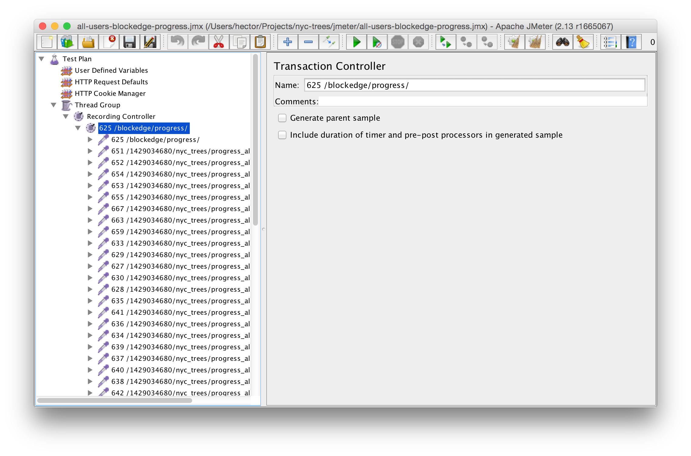
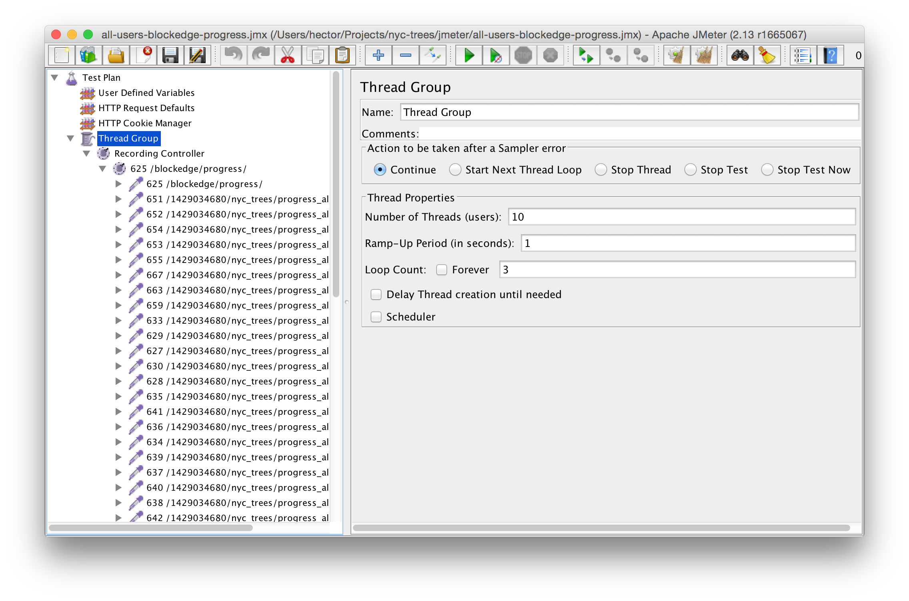
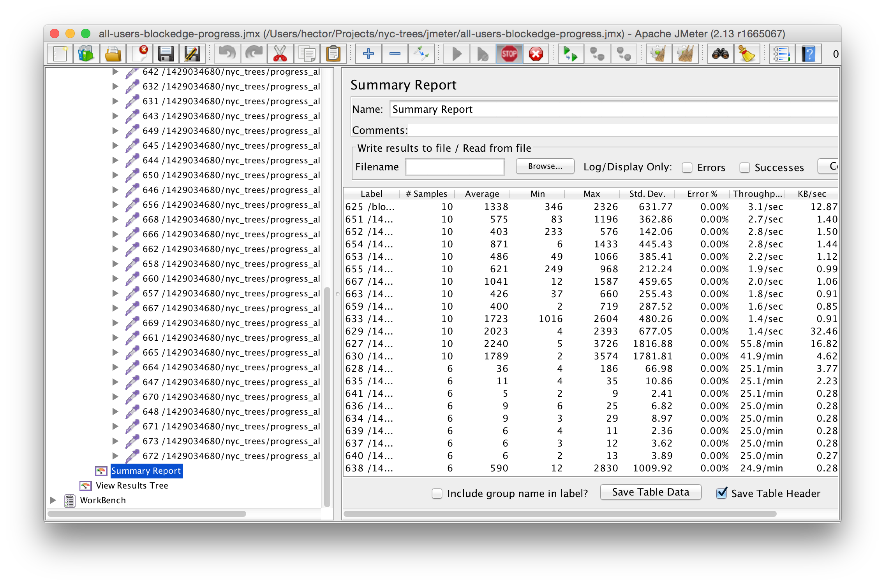

# JMeter Load Simulation Test Plans

The `.jmx` files in this directory are [Apache JMeter](http://jmeter.apache.org/) Test Plans for specific areas of the application.

## Recorded Steps

Each test plan contains pre-recorded interactions with the application. You can view the list of recorded interactions by expanding the `Test Plan > Thread Group > Recording Controller`:

## Load Parameters

JMeter also allows you to adjust load parameters, which help simulating `X` number of users going through the recorded steps `Y` times:

## Executing Test Plan

Lastly, to execute the test plan, just click the play button, or use `Run > Start` in the menu bar:

**Note**: By default, all test plans are setup to go against the local development virtual machine IP addresses.
